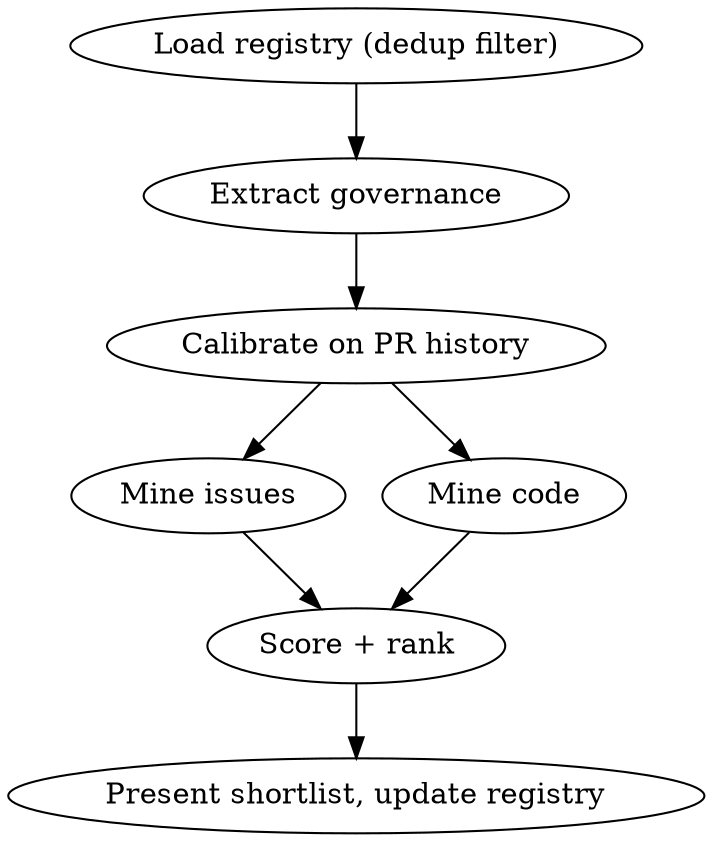

# OSS Contribute

## Overview

Scanner-qualifier for open-source contributions. The skill finds and qualifies work; Karl implements, forks, and opens PRs himself.

**Hard rule: never perform public actions.** No issue comments, no forks, no PRs, no reactions. Everything this skill does is read-only against GitHub plus local file writes.

**State** (create directories on first use):
- Registry: `~/.claude/oss-contributions/registry.md` — one line per candidate ever surfaced.
- Briefs: `~/.claude/oss-contributions/briefs/<owner>-<repo>-<id>.md`

**Modes:**

| Invocation | Mode |
|---|---|
| `/oss-contribute <owner/repo>` | Scan: produce a scored shortlist (~15 candidates) |
| `/oss-contribute <owner/repo> --brief <id>` | Brief: deep-dive one candidate into an attack brief |
| `/oss-contribute --discover [theme]` | Discover: find 5-8 new target repos |
| "mark <id> shipped/skipped" (conversational) | Update the registry verdict |

All GitHub access via `gh` CLI. For code mining, use a shallow clone in the scratchpad — never clone into Karl's projects.

## Mode: Scan



### 1. Load registry

Read `~/.claude/oss-contributions/registry.md`. Candidates already listed for this repo are excluded from the new shortlist (any verdict). This makes scans idempotent — a weekly routine only surfaces new work.

### 2. Extract governance (once, reused everywhere)

Fetch and read, tolerating absence:
- `CONTRIBUTING.md` (try root, `.github/`, `docs/`): PR rules, commit format, test requirements, DCO/CLA, target branch, "open an issue first" policies.
- `.github/PULL_REQUEST_TEMPLATE.md`: checklist fields a PR must fill.
- Repo metadata: `gh repo view <owner/repo> --json defaultBranchRef,licenseInfo,isArchived`

If no CONTRIBUTING exists: fall back to conventions observed in the commit log (commit message style, test-per-PR habits) and note "no CONTRIBUTING — calibrated from history only".
If a corporate CLA is required: flag it at the top of the shortlist (not blocking).
If the repo is archived: stop and say so.

### 3. Calibrate on PR history (what the repo REALLY accepts)

The CONTRIBUTING says what the project claims to want; closed PRs say what it accepts. Sample the last ~30 externally-authored PRs:

```bash
gh pr list -R <owner/repo> --state merged --limit 30 --json number,title,author,mergedAt,createdAt
gh pr list -R <owner/repo> --state closed --limit 30 --json number,title,author,closedAt,createdAt
```

Filter out PRs by maintainers/bots (author association, bot suffix). Derive:
- **Merge rate by PR type** (bugfix / docs / test / refactor / feature) — classify from titles.
- **Median time-to-merge** for external PRs.
- **Kill patterns**: PR types that get closed unmerged (e.g. unsolicited refactors, drive-by style changes).

### 4. Mine issues

```bash
gh issue list -R <owner/repo> --label "good first issue" --state open --json number,title,labels,assignees,createdAt
gh issue list -R <owner/repo> --label "help wanted" --state open --json number,title,labels,assignees,createdAt
gh issue list -R <owner/repo> --state open --limit 50 --json number,title,labels,assignees,createdAt
```

Keep issues that are: unassigned, no linked open PR (check the issue timeline for "linked a pull request"), not stale-bot-tagged, and actionable (a bug with repro, or a scoped feature — not a discussion thread).

### 5. Mine code (recent commits)

Shallow-clone into the scratchpad: `git clone --depth 200 https://github.com/<owner/repo> <scratchpad>/<repo>`

Look at the last ~60 days of commits for:
- **Declared debt** (highest value — the maintainer already said the work should happen): newly added `TODO`/`FIXME`/`HACK` comments (`git log -p --since="60 days ago"` grepping added lines), commit messages containing "temporary", "follow-up", "for now", "will fix", "workaround".
- **Pattern gaps**: a fix applied to one call-site where the same pattern exists elsewhere (grep the fixed pattern across the codebase).
- **Docs drift**: exported API changed but README/docs not touched in the same or subsequent commits.
- **Missing tests**: new source files or new exported functions with no matching test change.
- **Duplication / perf**: 3+ similar blocks, obvious hot-path inefficiencies.

Everything surfaces — the scoring layer ranks it (see the "unsolicited opinion" row in the scoring table for how opinion findings are labeled).

Candidate ids are stable handles used identically in the scan table, the registry `Id` column, `--brief <id>`, and brief filenames: `issue-<n>` for issue candidates, `commit-<shortsha>` for code-mined ones. The scan table's `source` column is the human-readable pointer (issue URL / sha); `id` is the handle.

### 6. Score and rank

Each candidate gets an acceptance-probability score from the calibration data:

| Signal | Effect |
|---|---|
| Matches a PR type with high external merge rate | strong + |
| Declared debt (maintainer's own TODO / "follow-up" commit) | strong + |
| `good first issue` / `help wanted` label | + |
| Bug with clear repro, unassigned, no linked PR | + |
| Requires touching >5 files or core architecture | − |
| Matches a kill pattern (type that gets closed unmerged) | strong − |
| Unsolicited opinion (refactor/style/perf without issue) | strong −; when the repo's history shows unsolicited PRs get closed, attach the label "open an issue first" |

### 7. Present and record

Output a table sorted by score: `id | source (issue #n / commit sha) | title | effort estimate (S/M/L) | score + one-line reason`. Top ~15. If fewer than 5 decent candidates exist, say so plainly — never pad the list.

Then append every presented candidate to the registry:

```markdown
| 2026-07-21 | vercel/ai | issue-1234 | Fix stream abort race | seen |
```

Verdicts: `seen` / `briefed` / `skipped` / `shipped`. Close by asking which candidates to brief.

## Mode: Brief

For each requested candidate, produce `~/.claude/oss-contributions/briefs/<owner>-<repo>-<id>.md`:

```markdown
# <repo> — <candidate title>

**Source:** <issue URL or commit URL> · **Scored:** <score + reason> · **Date:** <date>

## Nobody's on it
<assignee check, linked PRs, recent claiming comments — with dates. If someone IS on it, say so and stop.>

## Root cause / analysis
<for bugs: the actual root cause with file:line references from the clone; for features/debt: what exists today and why it falls short>

## Files to touch
<exact paths, what changes in each>

## Suggested approach
<numbered steps, known traps, alternatives considered>

## PR compliance checklist (from governance extraction)
- [ ] Commit format: <repo's convention>
- [ ] Tests required: <what the repo expects>
- [ ] DCO/CLA: <sign-off command or CLA link, or "none">
- [ ] Target branch: <branch>
- [ ] PR template fields: <list>
- [ ] Issue-first policy: <"open/claim issue #n before PR" or "direct PR accepted">

## Local verification plan
<package manager + install command, build command, how to run the relevant tests (exact filter), lint command — verified against the repo's package.json/CI config, not guessed>
```

Before writing: re-verify "nobody's on it" live (`gh issue view <n> --json assignees,comments` — check for claiming comments newer than the scan). Update the registry verdict to `briefed`.

The skill stops here. Fork, implementation, and PR are Karl's.

## Mode: Discover

`--discover [theme]` → find 5-8 repos worth contributing to, biased toward Karl's stack (TypeScript, React, NestJS, pnpm/monorepo tooling) unless a theme overrides it.

```bash
gh search repos --language=typescript --stars=">2000" [theme keywords] --json fullName,stargazersCount,pushedAt
```

For each candidate repo, apply the one criterion that matters: **do maintainers merge external PRs?** Check `gh pr list -R <repo> --state merged --limit 10` for non-maintainer authors within the last month. Prefer medium-size repos (a contribution is visible) over mega-repos. Output: repo, stars, external-merge evidence, one line on why it is good ground.

The registry's **Target repos** table is the curated list: exclude repos already in it from discover output, deprioritize any repo in its *Known-slow* line, and when Karl says "add <repo> to targets", append it to that table with a one-line why.

## Common Mistakes

| Mistake | Fix |
|---|---|
| Performing a public action (comment, fork, PR, reaction) | Never. Read-only + local writes. Karl does the public part. |
| Presenting opinion findings as ready-to-PR | Apply the "unsolicited opinion" scoring rule — the label lives there. |
| Trusting CONTRIBUTING over history | History wins. "Contributions welcome" + closed refactor PRs = refactors are not welcome. |
| Padding a weak shortlist to reach 15 | Say "only N decent candidates" and stop. |
| Skipping the live "nobody's on it" re-check at brief time | The scan data may be days old. Re-check assignee + comments before writing a brief. |
| Guessing the local verification plan | Read the repo's package.json scripts / CI workflow and cite the real commands. |
| Cloning into Karl's project directories | Shallow-clone into the scratchpad only. |
| Re-surfacing candidates already in the registry | Load the registry first; filter every scan through it. |
